# spikelocalizationtensor

Single-source tensor factorization of extracellular spike waveforms, with an interactive
browser for comparing spatial encodings.

Each spike is reconstructed as **one spatial footprint times one time course**. The spatial
part is a single discrete choice out of a large fixed codebook; the temporal part is a
low-dimensional basis shared across every spike in the recording. There is no neural
network and no gradient descent — both blocks of the fit have closed forms, so the
objective decreases monotonically and converges in about three iterations.

---

## The model

Spike `s` contributes a waveform `Y[s]` of shape `(C=10 channels, T=90 samples)`, taken on
the 10 contacts nearest its peak channel and DC-removed per channel. Writing `r[s,c]` for
the position of contact `c` relative to that spike's anchor:

```
Y[s, c, t]  ≈  g_s(c) · (v_s ᵀ a)[t]
```

**Spatial — `g_s`.** A codebook of candidates pairs a lattice site `μ_k` with a radial
profile `φ` at scale `σ_j`:

```
g_s(c) = φ( ‖ r[s,c] − μ_k ‖ ; σ_j )          peak-normalised to 1
```

The lattice fills a 300 µm cube around the anchor: uniform in x and y over ±150 µm,
**geometric in z** over [1, 300] µm, with `K = n³` sites for `n ∈ {8, 16, 32, 64}`. A
symmetric z range would be pure mirror degeneracy — both kernels depend on `|z|` — and a
uniform one spends half its samples past 150 µm where footprints are nearly flat.

Each spike selects **exactly one** `(site, profile)` pair. No soft mixture, no relaxation.
At the largest setting that is 262,144 sites × 60 profiles = **15.7 M candidates per
spike**.

**Temporal — `a`.** An orthonormal basis of shape `(Q, T)` learned from the data, with a
free per-spike coefficient vector `v_s ∈ ℝ^Q`. Every spike gets its own time course, but
constrained to a subspace shared by all of them.

**Objective** — plain reconstruction, no regulariser. One-of-N is the only constraint:

```
minimise   Σ_s ‖ Y[s] − g_s (v_sᵀ a)ᵀ ‖²_F   /   (N · C · T · var)
```

over `a`, the per-spike selections, and the coefficients `v_s`.

### Available spatial profiles

All are functions of the lateral and axial squared offsets separately, so anisotropic forms
share one signature with radial ones.

| name | φ(d; σ) | note |
|---|---|---|
| `monopole` | σ/√(d²+σ²) | the classic point-source falloff |
| `gauss` | exp(−d²/2σ²) | flattest peak |
| `exp` | exp(−d/σ) | **cusped** at the source, not smooth |
| `lorentz` | σ²/(d²+σ²) | monopole squared |
| `power` | (σ/√(d²+σ²))^p | monopole raised to a free exponent |
| `student` | (1+d²/σ²)^(−ν) | heavy-tailed |
| `yukawa` | monopole · exp(−d/λ) | screened Coulomb |
| `dog` | difference of Gaussians | **non-monotonic** — the only profile that can represent a surround |
| `gauss_aniso`, `mono_aniso` | independent lateral / axial scales | breaks the spherical assumption |

Families can be **mixed into one dictionary**, in which case a spike chooses its shape as
well as its position and scale.

---

## The solver

Eliminating `v_s` analytically gives an identity that drives everything. With
`u_s = g_sᵀ Y[s] / ‖g_s‖²`:

```
‖Y − g wᵀ‖²  =  ‖Y‖² − ‖g‖²‖u‖²  +  ‖g‖² ‖w − u‖²
```

Both blocks then have exact solutions, so the loss is monotone non-increasing:

**1. Assign** — with `a` fixed and orthonormal, the best candidate is the maximiser of a
**Rayleigh quotient** in the normalised footprint `ĝ`:

```
score_s(n) = ĝ_nᵀ (M_s M_sᵀ) ĝ_n ,     M_s = Y[s] aᵀ   (C × Q)
residual_s = ‖Y[s]‖² − max_n score_s(n)
```

**2. Refit** — with the selections fixed, minimising over `a` *and every* `v_s` jointly is
weighted PCA: `a` is the top-Q eigenvector set of `S = Σ_s u_s u_sᵀ`, a 90×90 scatter.

### Why 15.7 M candidates per spike is affordable

`M_s M_sᵀ` is **10×10 regardless of Q**, so the time-basis size drops out of the inner loop
entirely. Vectorising that symmetric matrix to its 55 unique entries turns the whole argmax
into a single GEMM — `Φ (|N| × 55) @ p_s (55 × B)` — at **110 FLOPs per spike-candidate**,
independent of Q. Candidates are built per channel-geometry (only ~106 distinct 10-contact
configurations exist on the probe) and chunked, so the expanded table is never
materialised.

---

## Baseline localizers

`spiketensor/baselines.py` provides two reference localizers that fit nothing. They bracket
the useful range and every learned model is reported against them.

**Monopole** — the standard analytic point-source fit the field already uses. This is the
target to beat.

**Anchor-only** — a *collapse control*. It discards the waveform entirely and places every
spike at its own peak channel, so it carries no positional information beyond which contact
fired.

The control exists because the pairwise-ZNCC score `C` rewards temporal self-similarity of
the localization image, and an image collapsed onto the channel lattice is maximally
self-similar. On this recording:

| localizer | C_hard | drift recovery (GT r) |
|---|---|---|
| anchor-only (collapse control) | **0.795** | +0.465 |
| monopole | 0.504 | **+0.865** |

The control scores **higher C than every fitted model measured** while recovering the
imposed drift far worse. **Read C as distance below the control, never as an absolute
quality score.**

---

## Repository layout

```
spiketensor/
  fit_lattice.py        the model and the exact alternating solver
  baselines.py          monopole and anchor-only reference localizers
  data.py               recording access, probe geometry, ground-truth motion
  waveforms.py          DC-removed batch loader + reconstruction reference bounds
  probe_geometry.py     nearest-contact neighbourhood lookup
  volume.py             voxel GridSpec and the Gaussian volume smoother
  zncc.py               shift-max ZNCC over depth lags
  dredge.py             rigid motion solve from the pairwise shift matrix
  gtscore.py            detrended correlation against the imposed drift

  dc_batch.py           D/C matrices + DREDge solve for every fit, in batch
  dc_movie.py           the shared six-panel D/C figure, and the I_t movies
  dc_table.py           the C table and the nMSE-vs-C figure
  convergence.py        per-fit loss trajectories and the family overlay
  viz_lattice.py        codebook, usage, example-spike and aggregate panels
  viz_centroid_basis.py centroid / time-basis panels, rasters and movies
  browser.py            builds the interactive HTML visualizer
docs/panels/            the screenshots used in this README
```

### Quickstart

```bash
pip install -r requirements.txt

# fit one model: 32³ sites × 10 monopole scales, Q=32 time basis
python -m spiketensor.fit_lattice --n 32 --Q 32 --kernel monopole

# a mixed dictionary — the spike picks its profile shape too
python -m spiketensor.fit_lattice --n 64 --Q 32 \
    --kernel monopole,gauss,exp,lorentz,student,dog

# reference localizers, measured through the identical pipeline
python -m spiketensor.dc_batch --controls --panels

# measurement + figures for everything fitted so far
python -m spiketensor.dc_batch --panels          # D and C, DREDge motion
python -m spiketensor.viz_lattice                # codebook / spike / aggregate panels
python -m spiketensor.viz_centroid_basis         # centroid, raster and movie panels
python -m spiketensor.convergence                # loss trajectories
python -m spiketensor.dc_table                   # C table + nMSE-vs-C figure
python -m spiketensor.browser                    # figures/index.html
```

Fits land in `runs/`, figures in `figures/`. Neither is tracked.

---

## The interactive visualizer

`python -m spiketensor.browser` writes a single self-contained `figures/index.html`: every
fit and every reference localizer as one row, filterable by hyperparameter, sortable by any
metric, with a click-through scatter and the full panel set inline.

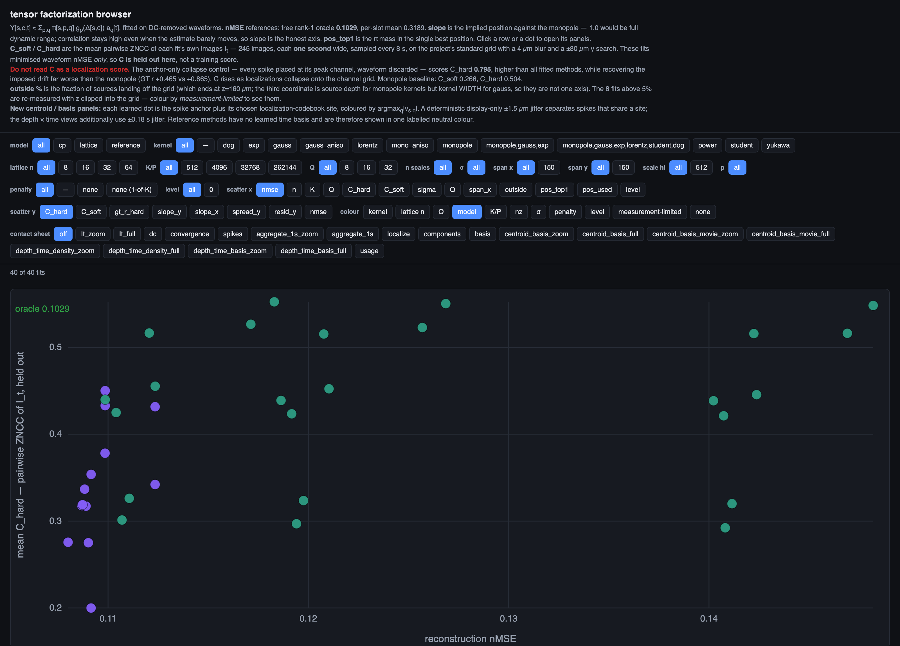

The top strip filters by model family, kernel, lattice size `n`, `K = n³`, `Q`, scale count
and penalty. The scatter axes are selectable on both x and y — reconstruction nMSE, mean
`C_soft` / `C_hard`, drift recovery, lattice size, fraction of sources off-grid — and dots
can be coloured by any factor. Clicking a dot selects its row; clicking a row opens its
panels. The **contact sheet** control renders any single panel across every filtered fit at
once, which is how a hyperparameter axis is best read.

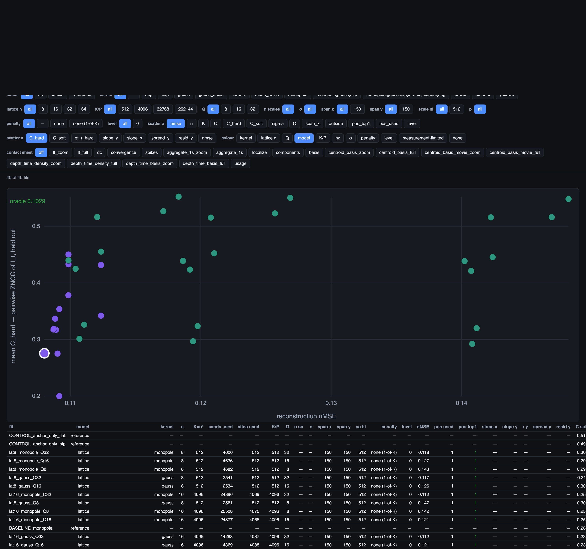

---

## The panels

Every row carries all of the following. Screenshots below are from `d_bank_all6` — a 64³
lattice with a six-family mixed dictionary, the best reconstruction in the sweep.

### `dc` — pairwise ZNCC and the recovered motion

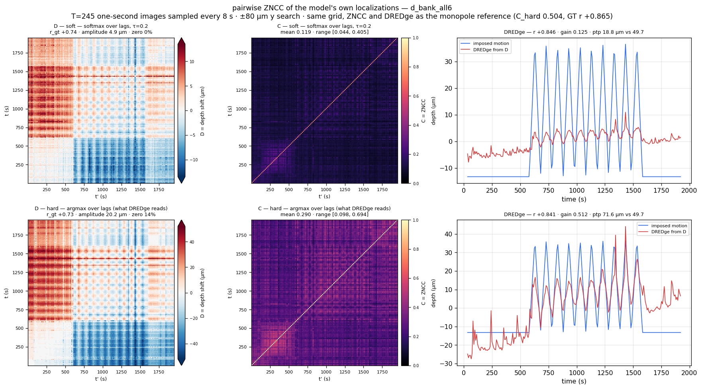

The core drift measurement. `D(t,t')` is the depth shift that best aligns the localization
images of two one-second bins; `C(t,t')` is the correlation at that shift. Top row uses a
softmax over lags, bottom row the argmax — the latter is what DREDge actually reads. The
right column shows the rigid motion solved from each `D`, overlaid on the imposed
ground-truth drift, with correlation, gain and peak-to-peak.

### `convergence` — the loss trajectory

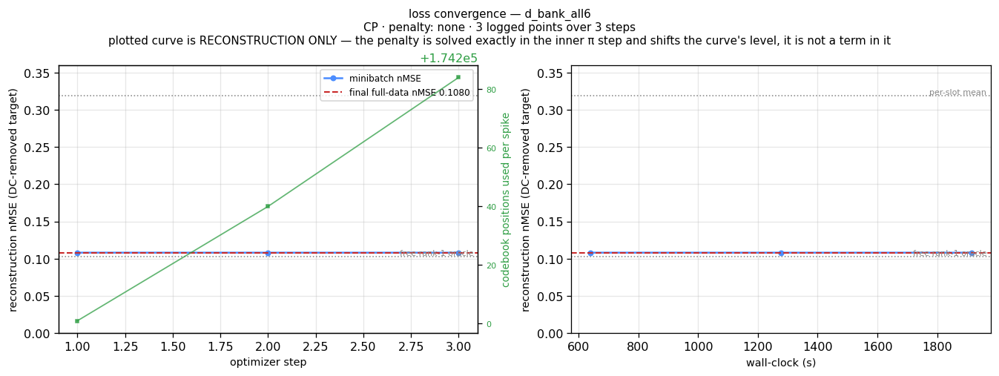

Reconstruction nMSE against iteration and wall-clock, with the free rank-1 oracle (0.1029)
and per-slot mean (0.3189) drawn as reference lines and the final full-data value marked.
Because both blocks of the solver are exact, these curves are monotone by construction.

### `spikes` — reconstruction quality, spike by spike

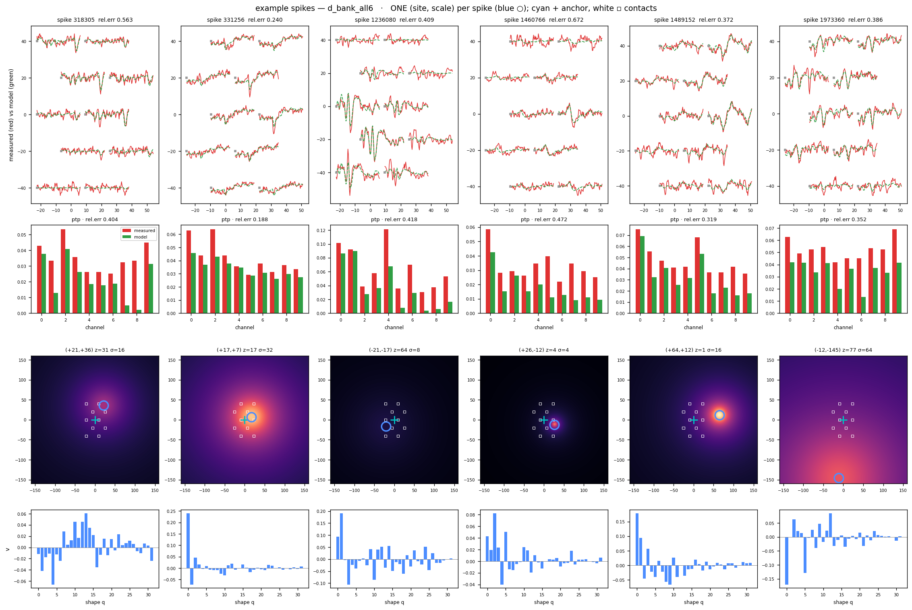

For a fixed set of example spikes: the measured waveform (red) against the model (green
dashed) laid out on the true contact geometry; per-channel measured-vs-model peak-to-peak
bars; the chosen spatial profile rendered on an x-y slice at the selected depth, with the
site marked and the contacts overlaid; and the coefficient vector `v_s`.

### `aggregate_1s` / `aggregate_1s_zoom` — one second of localizations

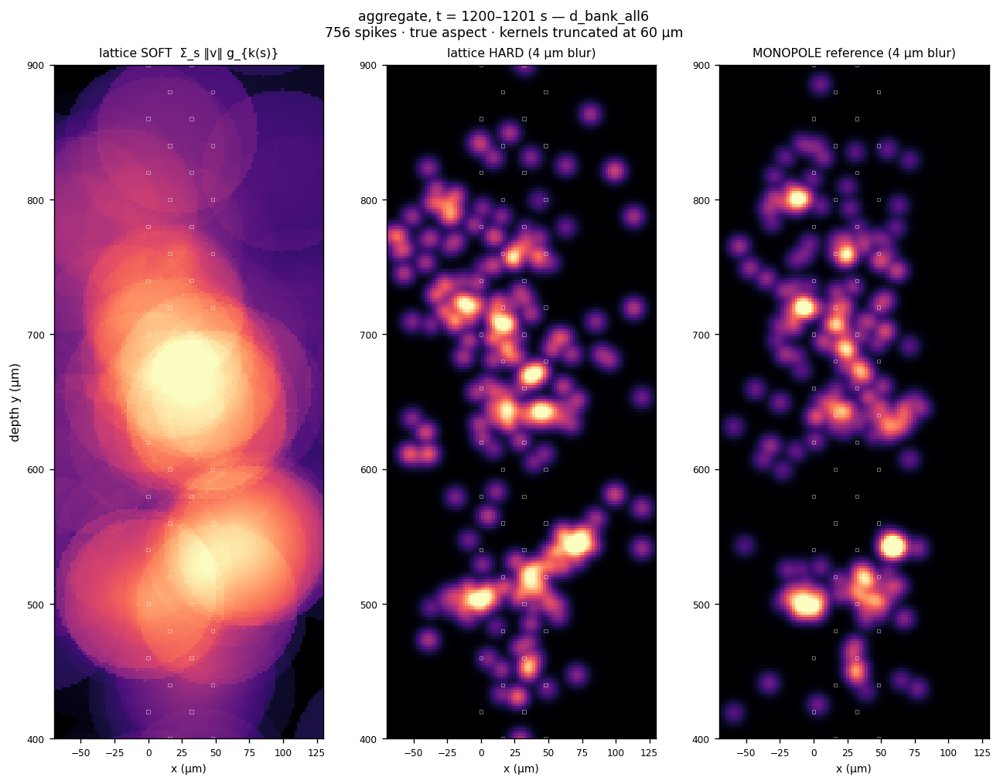

One second of spikes rendered three ways at true aspect: the model's own soft kernels
summed, the same as hard points at 4 µm blur, and the monopole reference for comparison.
Full-probe and 400–900 µm zoom variants.

### `localize` — implied position against the monopole

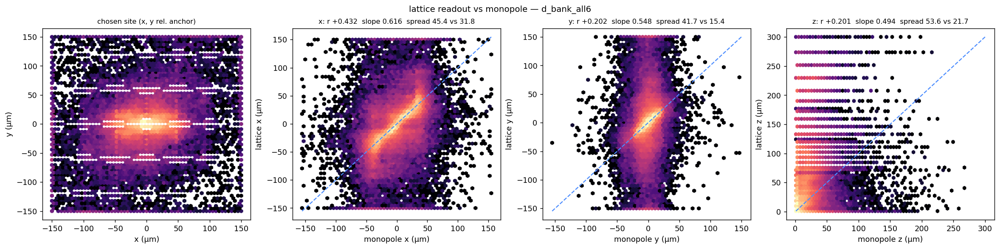

The chosen site's `(x, y, z)` against the monopole fit, per axis, with correlation, **slope**
and spread. Slope is the honest statistic: a shrunk estimate stays correlated while barely
moving, so correlation reads as success where slope reads as failure.

### `components` — what the codebook learned

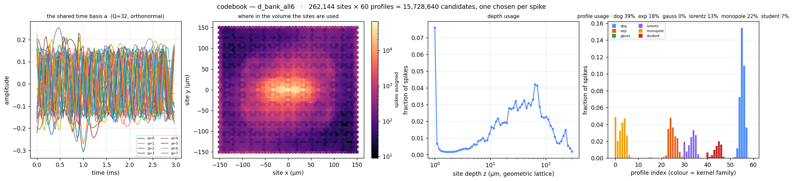

The time basis, where in the volume the sites actually get used, depth usage across the
geometric z lattice, and profile usage coloured by kernel family with per-family
percentages — which is how a mixed dictionary reveals its composition.

### `basis` — the time basis, one panel per component

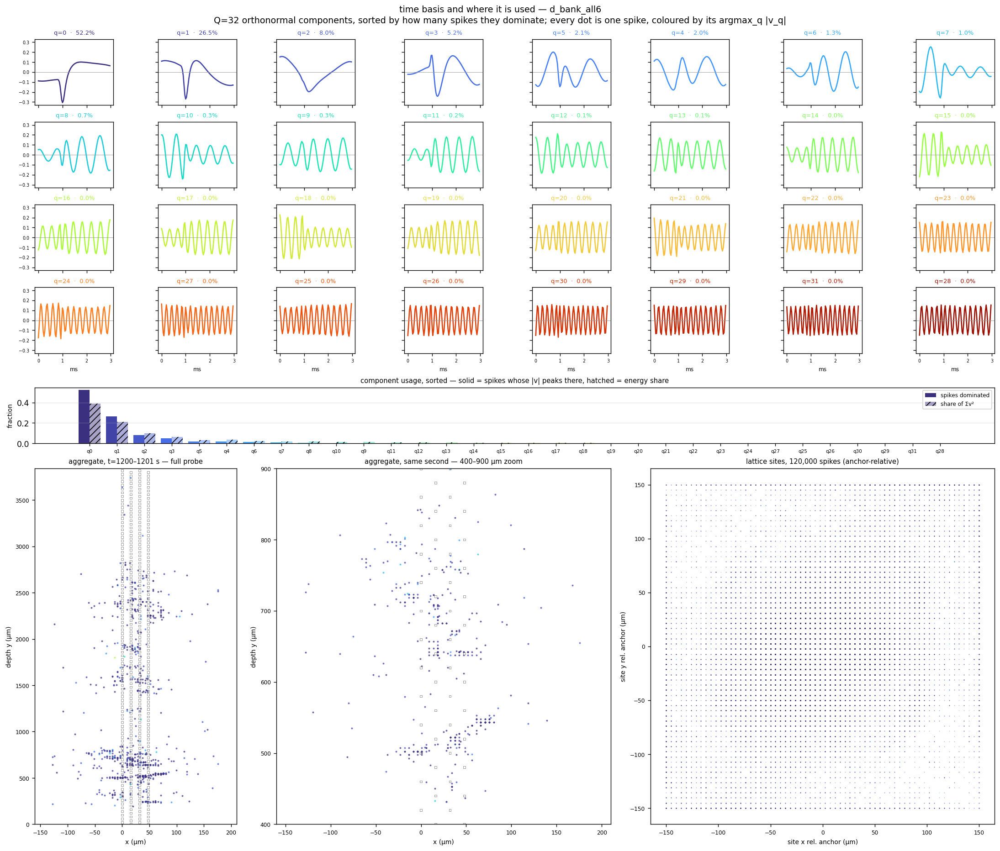

The overlaid basis is unreadable at Q=32, so each component gets its own panel, sorted by
usage and coloured by rank. Since `v_s` is free, no spike "uses" one component outright;
the hard label is `argmax_q |v[s,q]|`. The bar chart reports both how many spikes each
component dominates and its share of `Σv²`, because the two can disagree. The scatters
below colour every spike by its dominant component.

### `usage` — how concentrated the codebook is

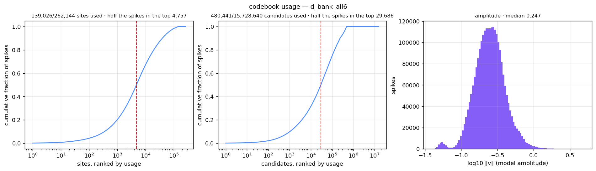

Cumulative share of spikes against sites and candidates ranked by usage, with the count
needed to cover half the spikes marked, plus the model-amplitude distribution.

### `centroid_basis_full` / `centroid_basis_zoom` — centroids coloured by time basis

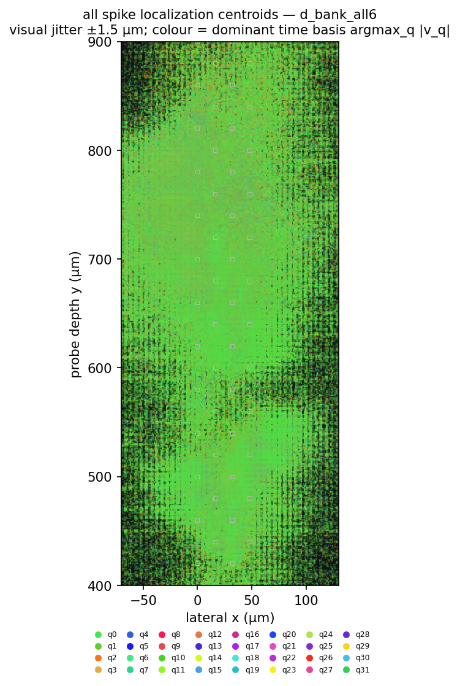

Every spike's global centroid — `anchor_xy + μ_site[:2]` — jittered ±1.5 µm and coloured by
its dominant time-basis component, in the same aspect as the aggregate views. The palette is
a deterministic shuffle indexed by the original `q`, so hue is stable across fits.

### `depth_time_density_full` / `depth_time_density_zoom` — the drift raster

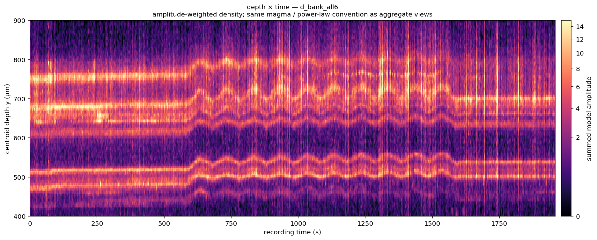

Depth against recording time, amplitude-weighted, in the same magma/power-law convention as
the aggregate views. This is the clearest view of the imposed motion in the whole repo:
flat unit bands for the first ~600 s, then the sawtooth engages and individual units track
it.

### `depth_time_basis_full` / `depth_time_basis_zoom` — the same raster, coloured by basis

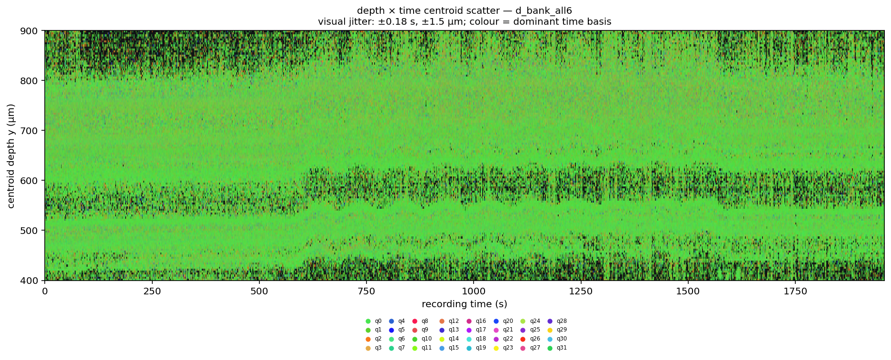

Identical geometry, but every centroid is a jittered dot coloured by its dominant time-basis
component rather than by density — so temporal structure and waveform-shape structure can be
read off the same axes.

### `It_zoom` / `It_full` — the images the ZNCC actually sees

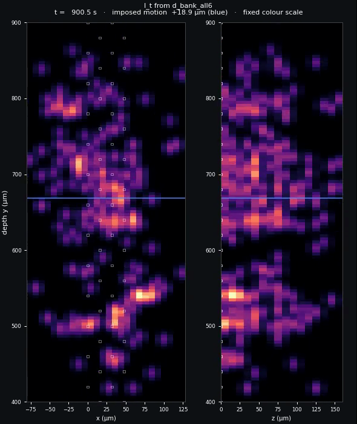

A movie at one second per frame of the smoothed localization volume `I_t`, on a fixed colour
scale with contacts overlaid and the imposed motion drawn as a line. These are the exact
inputs to the `D`/`C` computation, so drift that DREDge cannot recover is usually visible
here as an image that does not move.

### `centroid_basis_movie_zoom` / `centroid_basis_movie_full` — the centroid scatter over time

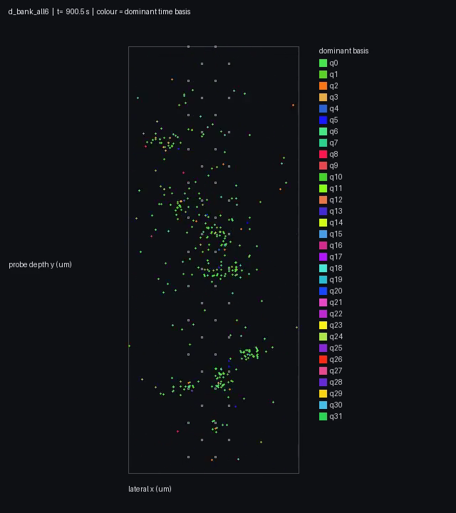

The same one-second binning as the centroid panels, animated, with colour still keyed to the
dominant time basis.

---

## Cross-fit summary figures

`dc_table.py` and `convergence.py` also write two figures that span the whole sweep rather
than a single fit.

**`figures/mse_vs_C.png`** — reconstruction against the held-out ZNCC score, with the
collapse control drawn on every panel. None of these fits optimised `C`, so it is a genuine
held-out measurement; the third panel is where `C` is shown not to track drift recovery.

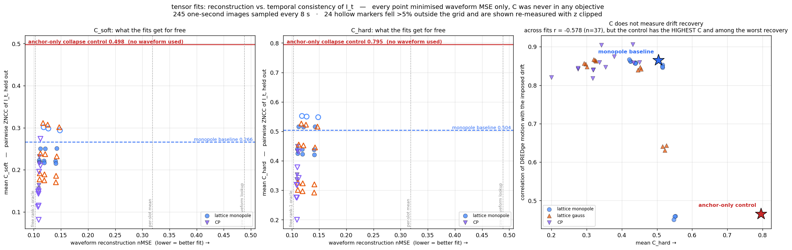

**`figures/convergence_all.png`** — every fit's loss trajectory overlaid, raw and
time-normalised.

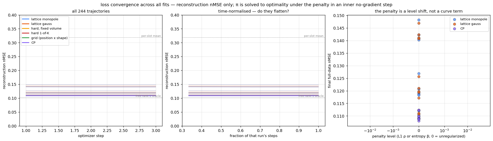

---

## Summary of findings

Across 37 fits on a 2.48 M-spike Neuropixels recording with imposed sawtooth drift:

**Reconstruction.** Best nMSE **0.1080**, against a free rank-1 oracle of 0.1029 — the error
when every spike gets its own unconstrained rank-1 factorization with no spatial structure
at all. So constraining the fit to a *single point source with one spherical scale, chosen
from a fixed codebook*, costs about 5%.

**The time basis dominates.** `Q = 8 → 32` moves nMSE by ~0.030. Growing the lattice 32³ →
64³ — eight times the sites — moves it by 0.0005, and scale resolution saturates above ~10
levels. Only profile *shape* and `Q` matter.

**Profile shape acts through the peak, not the tail.** Single-kernel ordering runs
`exp` (cusped, 0.1089) → `lorentz` (0.1092) → `monopole` (0.1099) → `gauss` (0.1107), which
is sharpest-peak to flattest-peak, not fastest-tail to slowest. Given a free exponent, the
model puts 47% of spikes on the sharpest available.

**Mixing shapes helps only when they genuinely differ.** Three monotone kernels together
improve on the best single one by 0.0002. Adding the non-monotonic difference-of-Gaussians
takes the top spot, with DoG the most-used family (38.6%) and Gaussian essentially never
chosen (0.2%).

**Reconstruction and localization disagree.** Two coarse-scale Gaussian fits — among the
*worst* reconstructors — give the best drift recovery (+0.906 and +0.904), beating the
monopole baseline's +0.865. Across all encodings the correlation between nMSE and drift
recovery is +0.87, falling to +0.52 without those two. The cleanest version needs no
correlation: three monopole variants with *identical* nMSE (0.1099) span GT r +0.858 to
+0.874, so reconstruction cannot rank them and localization can.

**A caveat carried in the table.** Fits whose sources reach past the measurement grid are
re-measured with positions clipped in, flagged, and drawn hollow. Raw and clipped drift
recovery agree to ≤0.003, but their `C` values are the clipped ones.

---

## Data

The fitting code expects a preprocessed recording exposing spike times, peak channels,
10-contact neighbourhood waveforms, contact geometry and a monopole localization for
comparison (see `spiketensor/data.py`). The recording itself is not distributed here.
