# spikelocalizationtensor

**One model for extracellular spike waveforms**, with an interactive browser and a 3-D
raster viewer for inspecting what it learned.

Every spike is reconstructed as a small number of **point sources**. Each source picks a
place, a shape, a lag and a loudness:

```
Ŷ_s  =  Σ_{r=1..R}  a_r · g(· ; μ_{n_r}, σ_{n_r}) · (S_{τ_r} ψ_{q_r})ᵀ
          └ loudness   └ spatial atom (learned)      └ shape atom, shifted
```

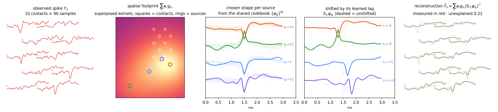

One spike carried end to end through the model (`prior2_shift_M64_R4`, R=4): the
measurement on its ten contacts; the superposition of the four selected spatial kernels
as a field, with the contacts as squares and the source centres as rings; the codebook
atom each source chose, bold against the cone of the codebook it came from; those atoms
after their learned lags `τ_r`; and the reconstruction in green over the measurement in
red. Regenerate it with `python3 docs/make_schematic.py --runs zncc/runs/onehot_prior`.

The spatial atoms are analytic kernels with **learned** centres and scales; the shape
codebook `{ψ_q}` is shared by every spike in the recording. Nothing here is an encoder
network: assignment is matching pursuit with exact coefficient refits, and the codebook
update is a closed-form block.

## One model, many configurations

Earlier versions of this project shipped a separate module per model. They are all the
same model at different settings, so there is now one implementation
(`spiketensor.unified`) and one config:

| knob | meaning |
|---|---|
| `R` | sources per spike (`R=1` is the classic rank-one template) |
| `M` | shape-codebook size |
| `kernel` | `monopole`, `gauss`, `exp`, `lorentz`, … any analytic decay |
| `max_shift` | lag range; `0` makes shape selection shift-**variant** |
| `shape` | `free` (coefficient vector) or `onehot` (one atom per source) |
| `nonneg` | non-negative amplitudes (one-hot only) |
| `P` | learned action-potential prototypes constraining the codebook; `0` = none |
| `cone_deg` | how far an atom may deviate from its prototype |
| `orthonormal` | keep the codebook row-orthonormal |

```python
from spiketensor.unified import Config, fit

fit(Config(R=1, shape="free",   orthonormal=True), out)             # rank-one template
fit(Config(R=4, shape="free",   orthonormal=True), out)             # multi-source, free shapes
fit(Config(R=4, shape="onehot", max_shift=0,  orthonormal=True), out)  # one-hot, no lags
fit(Config(R=4, shape="onehot", max_shift=10, orthonormal=True), out)  # + shift invariance
fit(Config(R=8, shape="onehot", max_shift=10, P=2, cone_deg=35), out)  # + prototype prior
```

**Orthonormality and the prototype prior are mutually exclusive, and the code refuses to
pretend otherwise.** `M` unit vectors cannot all sit inside small cones about `P ≪ M`
prototypes *and* be mutually orthogonal; requesting both raises rather than silently
dropping one. That tension is the reason the prior exists: orthogonality is exactly what
drives a large free codebook into Fourier-like atoms, because the spike-shaped directions
get used first and only oscillatory ones remain.

## What the configuration buys

Sweeping `R` and `M` over both kernels on 2,475,738 spikes (variance explained, %):

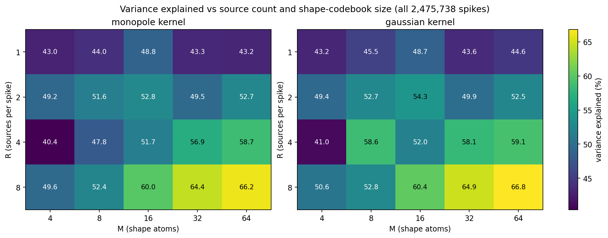

The axes **interact**: more sources are worth +23.0 points at `M=64` but only +6.6 at
`M=4`, and more shapes are worth +16.6 points at `R=8` but **+0.2** at `R=1`. One source
cannot use a rich vocabulary; many sources cannot use a poor one. The spatial kernel
barely matters — the Gaussian equals or beats the monopole in 18 of 20 cells, and the
learned prototypes come out essentially identical either way.

The `P=2` prototypes are learned, not templates, and they **sharpen with capacity** (mean
depolarizing FWHM 2.08 ms at `R=1` → 0.29 ms at `R=8`), so a prototype read off a
low-capacity fit is an under-modelling artifact rather than a cell type:

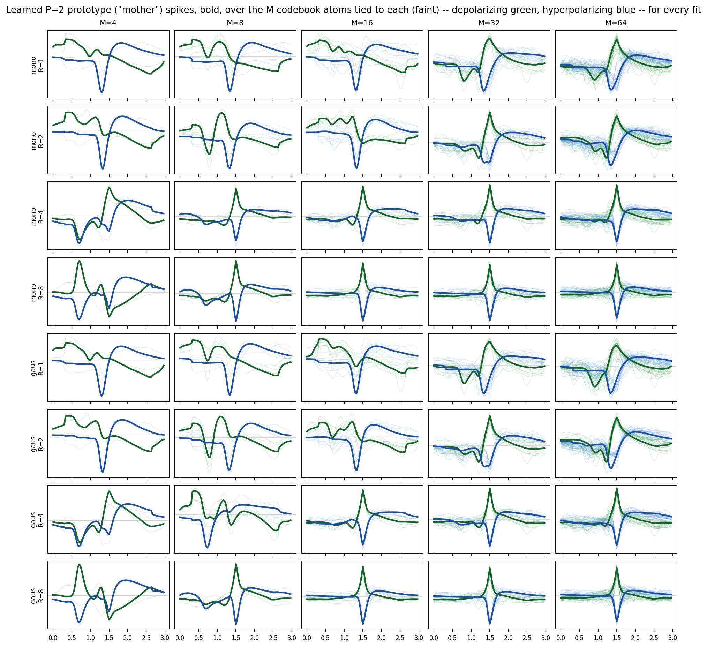

**A caveat worth stating loudly:** reconstruction quality does **not** predict
localization quality. Across 40 fits, the correlation between variance explained and
drift-recovery accuracy is **−0.045**. Select models for drift work on the downstream
task, never on fit error.

## Panels

### Spike reconstruction

Measured (red) against the model (green) on the 10 nearest contacts, drawn at their real
probe positions. Every model in the browser shows the **same** spikes, so panels are
directly comparable across configurations.


Per-source decomposition — observed, each active source term, total, residual:

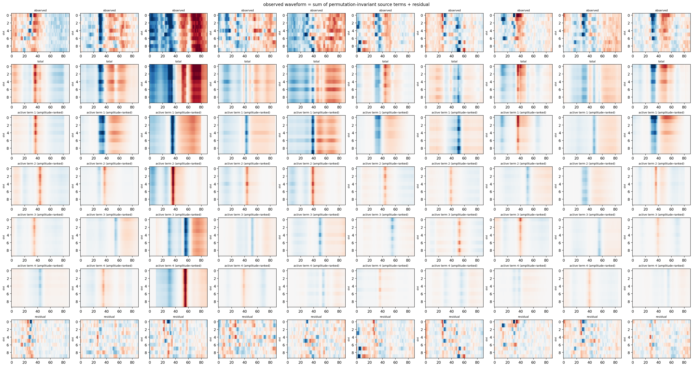

### Depth × time rasters, with and without drift correction

Coloured by **amplitude** (uncorrected, then canonical nonrigid `dredge_ap`):


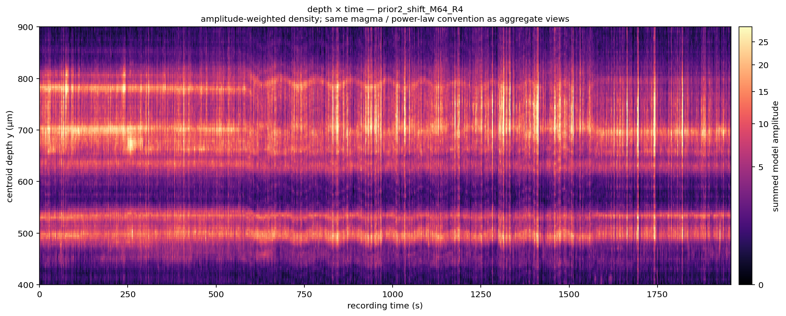

Coloured by **shape**, using a local-neighbourhood PCA that maximises colour diversity —
the codebook coefficients are projected to RGB by a 3-component PCA refitted inside
overlapping 200 µm depth blocks and rank-equalised, so nearby units get separable colours
instead of the washed-out middle of the colour cube:


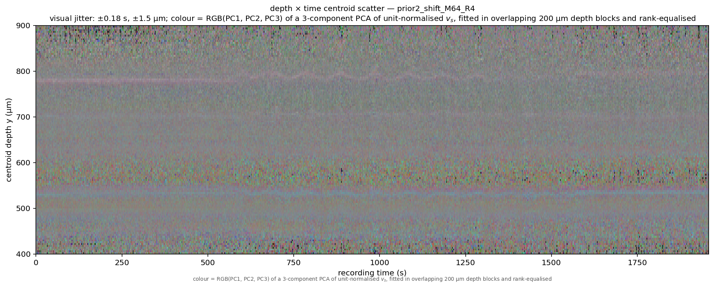

Straightening the sawtooth in the corrected panels is the actual test of the pipeline;
whatever remains is motion the model could not see.

### Others

| | |
|---|---|
|  | 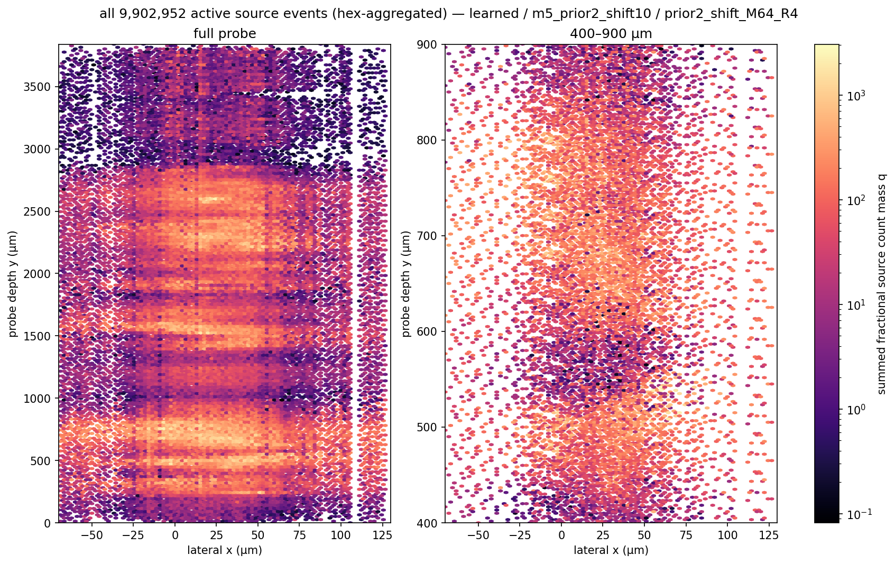 |
| shape codebook and where it is used | every active source, by contribution |
| 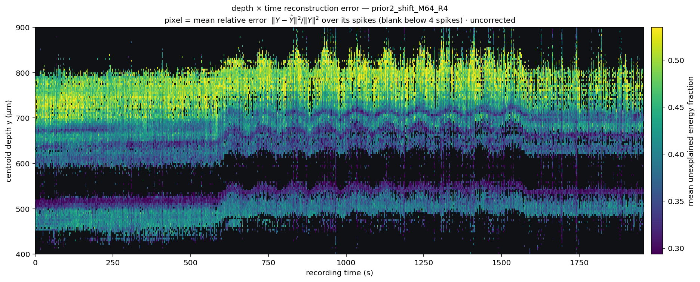 | 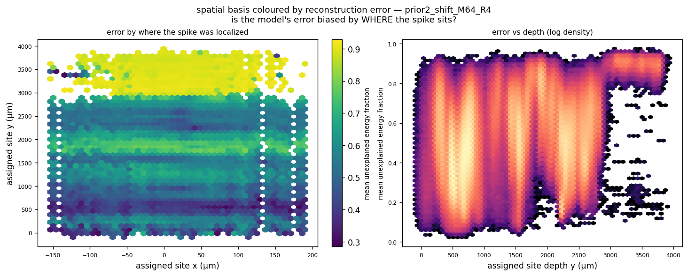 |
| where the model fits badly | is the error biased by location? |
| 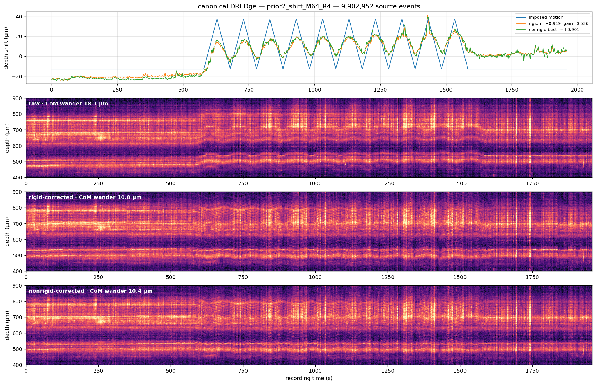 | 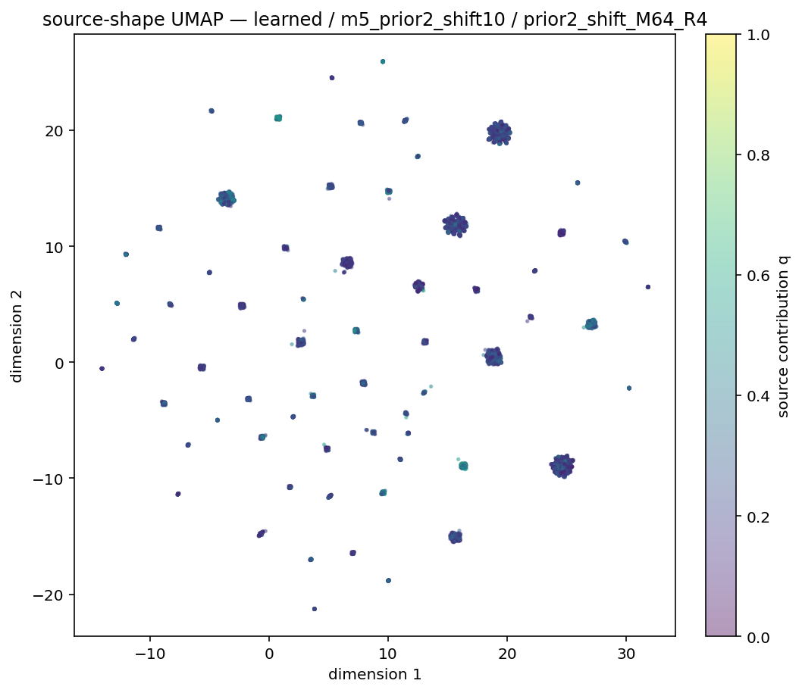 |
| canonical `dredge_ap` vs imposed motion | shape space (UMAP of the coefficients) |
|  |  |
| every source centroid, shape-coloured | one second, amplitude-weighted |
|  |  |
| the spatial dictionary and its usage | codebook occupancy |
|  |  |
| localization readouts | objective per outer iteration |
|  |  |
| frame from the 1 s/frame `I_t` movie | frame from the centroid movie |
|  |  |
| convergence across fits | one panel across every fit, in the browser |

## Motion correction

This package reports **one** motion estimate: canonical SpikeInterface `dredge_ap`, rigid
and nonrigid. The project's earlier internal soft/hard ZNCC solve is not distributed —
three estimates that disagreed made every panel ambiguous about which was being shown.
Corrected panels carry the suffix `_drr` (rigid) or `_drn` (nonrigid).

> **Pitfall, fixed here, worth knowing if you reimplement it:** `dredge_ap` log1p-bins
> amplitudes and thresholds window weights at 0.2. Model amplitudes (‖v‖ median ≈ 0.2)
> sit in the linear regime, so the histogram silently vanishes and rigid correlation
> collapses from +0.93 to +0.25 while nonrigid looks fine. `dredge_real.py` rescales
> amplitudes to median 100 before the call.

## The browser

```bash
python -m spiketensor.browser --runs runs/ --figs figures/
```

Builds a single filterable, sortable page over every fit: reconstruction, codebook,
localization, rasters, aggregates, error panels, DREDge traces, and 1 s/frame movies —
each in uncorrected, rigid and nonrigid variants.


## 3-D raster viewer

```bash
python -m spiketensor.atom_viewer --state runs/multipole_<tag>.npz --tag <tag>
```

Writes one **self-contained HTML** file (plotly inlined, all points embedded — no server,
no network). It shows the source cloud in *time × lateral x × depth*, which the 2-D
rasters collapse:

- rotate / zoom, with independent aspect sliders per axis (a 1958 s × 200 µm × 3840 µm
  volume is unreadable at 1:1:1)
- camera presets, including an orthographic **depth × time** view that reproduces the 2-D
  raster exactly
- switch between shape atoms, or merge them all
- colour by atom, by amplitude, or by **per-spike reconstruction error**, with min/max
  error filters
- **click anywhere** to inspect the nearest spike: measured vs model on the 10 fitted
  channels, or across **all 384** with the model *extrapolated* to channels it never saw

The last point is possible because the spatial footprint is analytic, so it evaluates
anywhere on the probe. The extrapolation divides by the same 10-channel norm the fit used,
and units are tied by a single scalar fitted on the fit channels only — leaving the other
374 channels an honest out-of-sample test.

Static per-atom rasters (`spiketensor.atom_rasters`) and 3-D scatters
(`spiketensor.atom_scatter3d`) are also available.

Full derivation, solver and evaluation details: [docs/MODEL.md](docs/MODEL.md).

## Install

```bash
pip install -r requirements.txt
```

Needs a recording in the loader's format (`spiketensor.data`): detected spikes, denoised
10-channel waveforms, probe geometry. `dredge_real` additionally needs SpikeInterface.

## Not included

The heteroscedastic noise-model study is not ready to distribute and is not part of this
package.
